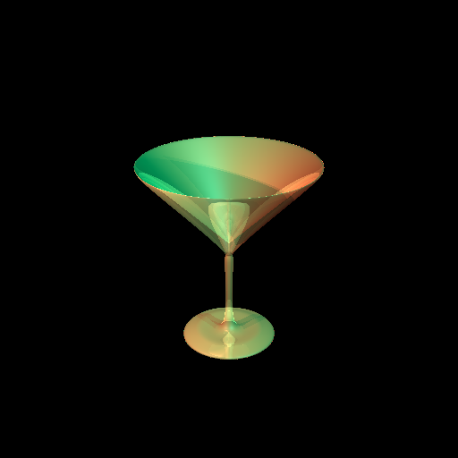
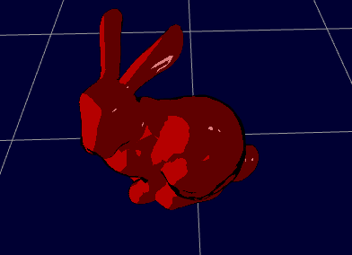
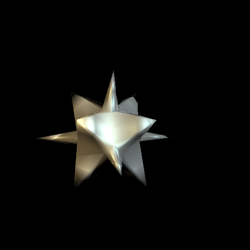
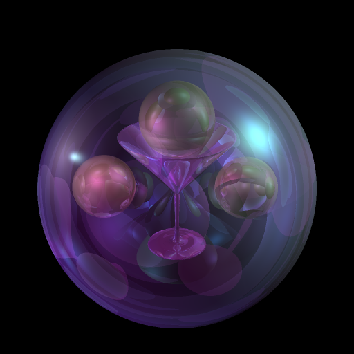

# Computer Graphics School Project
(Code can not be revealed due to some project copyright contents)
### By Qiming Guan

#### Contributions in the project
  - Implemented an API creating meshes with a provided edge curve to form a surface of revolution.
  
Ex Revolution_mesh:

  - Developed an API for mesh filtering
  - Implemented several shaders using OpenGL shader programming languages including alpha test shader, pointlight shdaer, spotlight shader, bling-phong shader, cartoon shader
  
  Ex Cartoon_shader:
  
  
  
  Ex Bling_phone_shader with pointlight:
  
  
  
  - Implemented ray tracing that uses bling-phong shader and produces realistic refraction, reflection and shadow within a scene. (Beer's shadow attenuation effect is also achieved)
  
  Example ray-tracing frame:

  
  - Animation curve (In progress)
