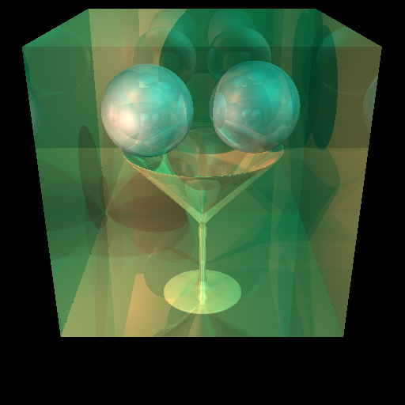

# Computer Graphics School Project
### By Qiming Guan

#### Contributions in the project
  - Implemented an API creating meshes with a provided edge curve to form a surface of revolution.
  - Developed an API for mesh filtering
  - Implemented several shaders using OpenGL shader programming languages including alpha test shader, pointlight shdaer, spotlight shader, bling-phong shader, cartoon shader
  - Implemented ray tracing that uses bling-phong shader and produces realistic refraction, reflection and shadow within a scene. (Beer's shadow attenuation effect is also achieved)
  - Animation curve (In progress)

Example ray-tracing frame:

Aforementioned contribution can be experimented using QT IDE to clone this project.
